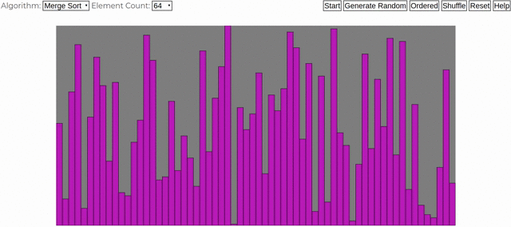

 
# Sorting Visualization
***

# Description
* Sorting algorithms visualization using **p5.js**
* Official **p5.js** website: https://p5js.org/
* See the LICENSE file for details.
# Run
* Open `index.html` in your browser.
* You can select your algorithm from top left corner.
* When you are ready, click to `start` button.
# Contributing
* Fork and clone the repository.
* Make your contribution.
* Push and open a pull request.
* All ideas and helps are welcome. For more, please contact with me.
# Authors
* Mert Türkmenoğlu
